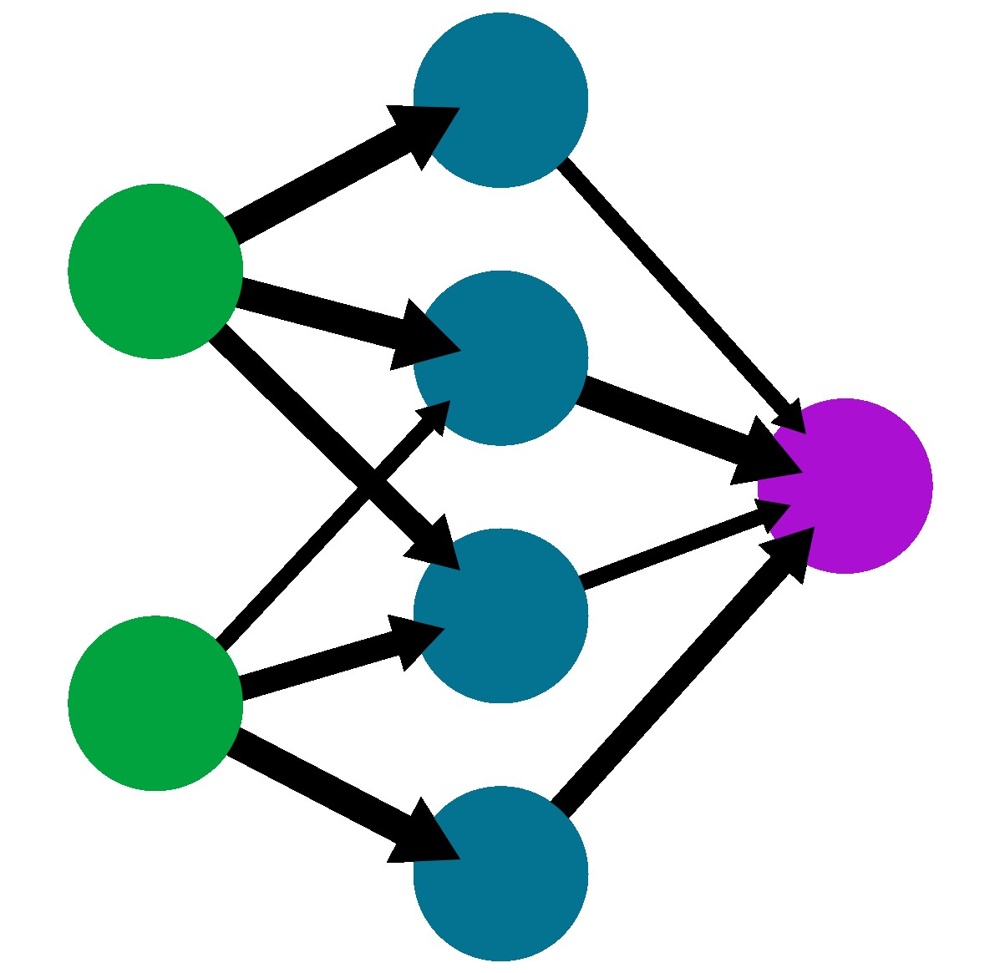

<a name="readme-top"></a>

<!-- PROJECT LOGO -->
<br />
<div align="center">
  <a href="https://github.com/janskn/machine-learning-library">
    
  </a>

  <h3 align="center">Machine Learning Library</h3>

  <p align="center">
    A simple library for machine learning topics like neural networks.
    <br />
    <a href="https://github.com/janskn/machine-learning-library"><strong>Explore the docs »</strong></a>
    <br />
    <br />
    <a href="https://github.com/janskn/machine-learning-library/issues">Report Bug</a>
    ·
    <a href="https://github.com/janskn/machine-learning-library/issues">Request Feature</a>
  </p>
</div>


<!-- ABOUT THE PROJECT -->
## About The Project

This library implements machine learning features only using numpy.
So far, it supports creating neural networks with dense layers, different activation functions and loss functions.
You can save your trained network to the storage and evaluate its performance.

The library is constantly getting expanded.

<p align="right">(<a href="#readme-top">back to top</a>)</p>


### Built With

This project was built with Python

<p align="right">(<a href="#readme-top">back to top</a>)</p>


### Installation

_Follow these steps to run the project._

1. Clone the repo
   ```sh
   git clone https://github.com/janskn/machine-learning-library.git
   ```
2. Install Python
   ```sh
   sudo apt-get install python3
   ```
3. Install Numpy
   ```sh
   pip install numpy
   ```
4. Install dill
   ```sh
   pip install dill
   ```
5. Install matplotlib
   ```sh
   pip install matplotlib
   ```
6. If you want to try out the digit recognition (mnist) example, install tensorflow for training data
   ```sh
   pip install tensorflow
   ```

<p align="right">(<a href="#readme-top">back to top</a>)</p>


<!-- USAGE EXAMPLES -->
## Usage

To create a network import the following:
```python
import numpy as np
from dense_layer import Dense_layer
from activation_functions import your_activation_function
from loss_functions import your_loss_function, your_loss_function_derivative
from network import your_function
````
Create a neural network:
```python
neural_network = [
  Dense_layer(x, y),
  your_activation_function(),
  ...
  Dense_layer(y, z),
  your_activation_function()
]
```

You can now train, save, evaluate, ... the network.
To get an idea, have a look into the examples folder.

<p align="right">(<a href="#readme-top">back to top</a>)</p>


<!-- CONTRIBUTING -->
## Contributing

If you have a suggestion that would make this better, please fork the repo and create a pull request. You can also simply open an issue with the tag "enhancement".
Don't forget to give the project a star! Thanks again!

1. Fork the Project
2. Create your Feature Branch (`git checkout -b feature/AmazingFeature`)
3. Commit your Changes (`git commit -m 'Add some AmazingFeature'`)
4. Push to the Branch (`git push origin feature/AmazingFeature`)
5. Open a Pull Request

<p align="right">(<a href="#readme-top">back to top</a>)</p>


<!-- LICENSE -->
## License

Distributed under the MIT License. See `LICENSE` for more information.

<p align="right">(<a href="#readme-top">back to top</a>)</p>
